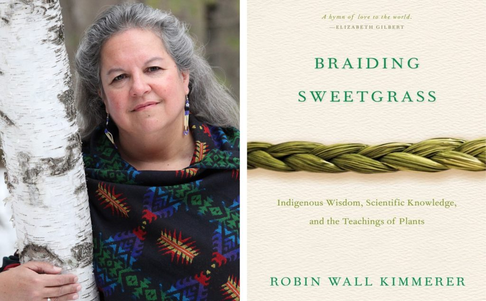

```{r setup, include=TRUE, warning = FALSE, message = FALSE}
knitr::opts_chunk$set(echo = TRUE, warning = FALSE, message = FALSE)

# packages to attach
library(tidyverse)
library(tidytext)
library(textdata)
library(pdftools)
library(ggwordcloud)
library(here)
library(wesanderson)
```
### Overview:
#### *Braiding Sweetgrass: Indigenous Wisdom, Scientific Knowledge and the Teachings of Plants* is a nonfiction book by Robin Wall Kimmerer, an enrolled member of the Citizen Potawatomi Nation and a professor at SUNY-ESF. In this book she explores the relationships between humans and land and the roles that both Indigenous knowledge and Western scientific approaches play in understanding and appreciating these relationships. Kimmerer describes the book as "an invitation to celebrate the gifts of the earth."

#### The following is an exploration of the text in *Braiding Sweetgrass* with visual representations of trends, patterns, and sentiments.

<br>

<br>
<br>


#### Top 100 words in *Braiding Sweetgrass*

```{r, fig.align = "center"}
# Read in the data from pdf
braiding_sweetgrass <- pdf_text(here("files", "braiding_sweetgrass.pdf"))

# Wrangle the text
braiding_lines <- data.frame(braiding_sweetgrass) %>% 
  mutate(page = 1:n()) %>% 
  mutate(text_full = str_split(braiding_sweetgrass, pattern = '\\n')) %>% 
  unnest(text_full) %>% 
  mutate(text_full = str_trim(text_full))

braiding_tidy <- braiding_lines %>%
  slice(-(1:194)) %>% 
  unnest_tokens(word, text_full, token = "words") %>% 
  select(page, word)

# Remove stop words
braiding_words_clean <- braiding_tidy %>% 
  anti_join(stop_words, by = 'word')

# Count words
word_counts <- braiding_words_clean %>% 
  count(word)
  
# Find the top 100 words 
top100_words <- word_counts %>% 
  arrange(-n) %>% 
  slice(1:100)

palette <- wes_palette("Cavalcanti1", 4, type = "continuous")

# Make a wordcloud
wordcloud <- ggplot(data = top100_words, aes(label = word)) +
  geom_text_wordcloud(aes(color = n, size = n), shape = 'circle') +
  scale_size_area(max_size = 10) +
  scale_color_gradientn(colors = palette) +
  theme_minimal() +
  labs(title = "Braiding Sweetgrass Word Cloud")

wordcloud
```

**Figure 1.** Wordcloud displaying the top 100 words used in *Braiding Sweetgrass*. Stop words (as, the, if, and etc.) were removed. 


<br>
<br>


#### A sentiment analysis with the NRC lexicon 
The NRC Emotino Lexicon is a compiled list of English words and their associated emotion, from eight basic emotions (anger, fear, anticipation, trust, surprise, sadness, joy, and disgust) or sentiment (positive and negative). 
```{r, fig.align = "center"}
braiding_nrc <- braiding_words_clean %>% 
  inner_join(get_sentiments("nrc"))

braiding_nrc_counts <- braiding_nrc %>% 
  count(page, sentiment)

palette10 = wes_palette("Cavalcanti1", 10, type = "continuous")

ggplot(data = braiding_nrc_counts, aes(x = page, y = n)) +
  geom_col(aes(fill = sentiment), show.legend = FALSE) +
  scale_fill_manual(values = rev(palette10)) +
  facet_wrap(~sentiment) +
  coord_flip() +
  theme_minimal() +
  labs(y = "Word count", x = "Page number", title = "Sentiment analysis of Braiding Sweetgrass using the NRC lexicon")


```

**Figure 2.** Plots faceted by sentiments of *Braiding Sweetgrass* using the NRC lexicon by word count and page number. Stop words (as, the, if, and etc.) were removed. 


```{r, fig.align = "center"}
ggplot(data = braiding_nrc_counts, aes(y = sentiment, x = n)) +
  geom_col(aes(fill = sentiment),show.legend = FALSE) +
  scale_fill_manual(values = rev(palette10)) +
  theme_minimal() +
  labs(x = "Word count", y = "Sentiment", title = "Sentiment analysis of Braiding Sweetgrass using the NRC lexicon")
```

**Figure 3.** Column graph showcasing the words of *Braiding Sweetgrass* subdivided into sentiments using the NRC lexicon. Stop words (as, the, if, and etc.) were removed. 


<br>
<br>


#### **Data citation:** 
Kimmerer, Robin Wall. 2013 Braiding Sweetgrass. Minneapolis, MN: Milkweed Editions.


**For NRC lexicon**: Crowdsourcing a Word-Emotion Association Lexicon, Saif Mohammad and Peter Turney, Computational Intelligence, 29 (3), 436-465, 2013.

