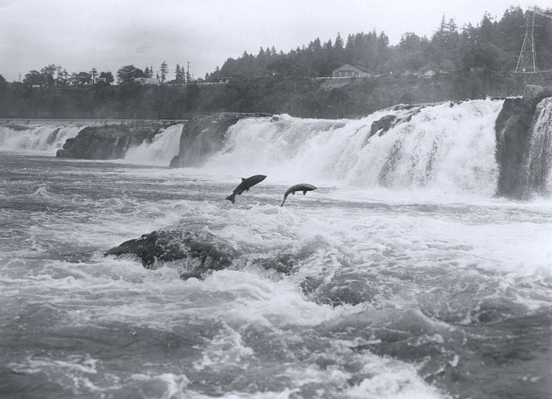
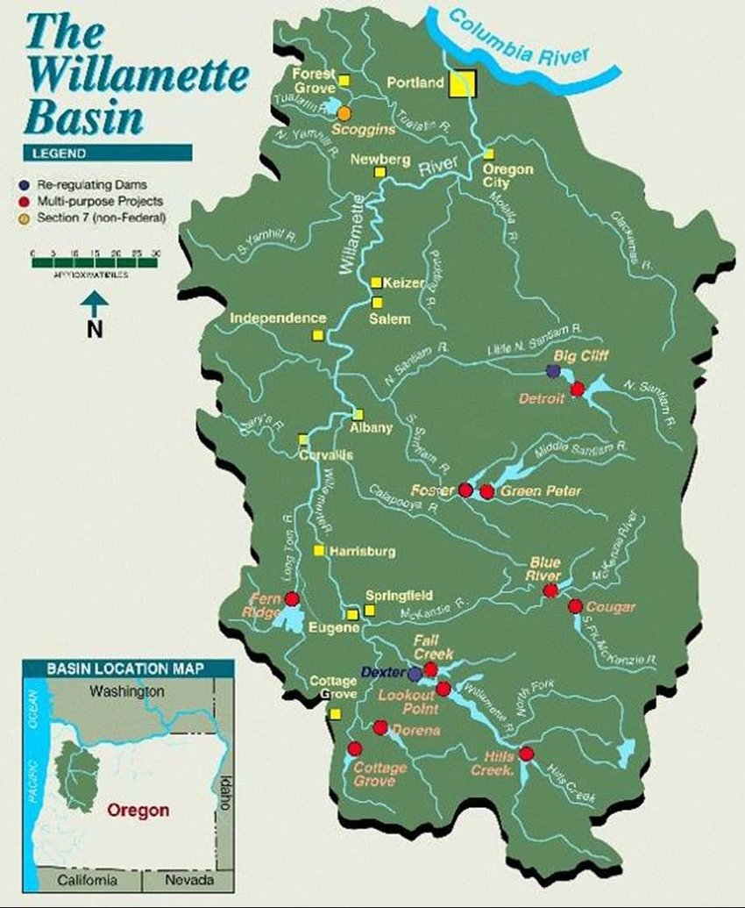
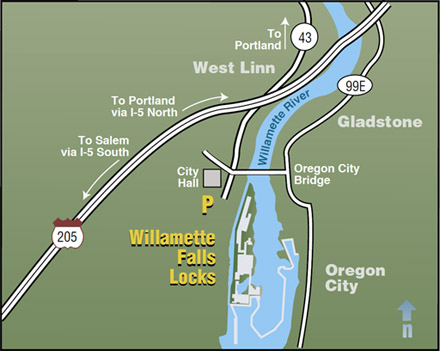

```{r setup, include=TRUE, warning = FALSE, message = FALSE}
knitr::opts_chunk$set(echo = TRUE, warning = FALSE, message = FALSE)

# Packages to attach

library(prettydoc)
library(here)
library(tidyverse)
library(wesanderson)
library(janitor)
library(tsibble)
library(feasts)
library(lubridate)
library(patchwork)
library(slider)
```

### **Overview:**
#### This report explores and visualizes data for adult fish passage at the Willamette Falls fish ladder on the Willamette River, Oregon from January 1, 2001 to December 31, 2010. The species included in this dataset are Coho, Jack coho, and Steelhead. The three tabs include visualizations for fish counts across various time periods. Data are recorded and made accessible by the Columbia River DART project. 

<br>



Accessed from: [Image source](https://www.visionlearning.com/blog/2013/10/11/return-king-salmon/)

<br>

{width=500px}

Accessed from: [Image source](https://www.researchgate.net/publication/268262499_A_REVIEW_OF_ADULT_SALMON_AND_STEELHEAD_LIFE_HISTORY_AND_BEHAVIOR_IN_THE_WILLAMETTE_RIVER_BASIN_IDENTIFICATION_OF_KNOWLEDGE_GAPS_AND_RESEARCH_NEEDS_Prepared_by)

<br>



Accessed from: [Image source](https://www.nwp.usace.army.mil/willamette/locks/)


```{r}
fish_passage <- read_csv(here("data", "willamette_fish_passage.csv")) %>% 
  clean_names()
```


### Data citation:
Data shared by and accessed from [Columbia River DART](http://www.cbr.washington.edu/dart). Data Courtesy of [U.S. Army Corps of Engineers, NWD](https://www.nwd.usace.army.mil/) and [Chelan](https://www.chelanpud.org/), [Douglas](https://douglaspud.org/), and [Grant](https://www.grantpud.org/) County PUDs, [Yakima Klickitat Fisheries Project](http://www.ykfp.org/), [Colville Tribes Fish & Wildlife (OBMEP)](http://nrd.colvilletribes.com/obmep/), [Oregon Department of Fish & Wildlife](https://www.dfw.state.or.us/), [Washington Department of Fish & Wildlife](https://wdfw.wa.gov/).


## Data Analysis {.tabset}

```{r}
fish_tidy <- fish_passage %>% 
   pivot_longer( # tidies data by consolidating species into one column called species
    cols = c(steelhead, coho, jack_coho),
    names_to = "species",
    values_to = "fish_count"
  ) %>% 
  mutate(date = mdy(date)) %>% # converts date to y-m-d format
  select(date, species, fish_count) %>% # retains only date, species, and fish_count variables
  mutate(species_name = case_when( # creates new column with species' full names
    species == "coho" ~ "Coho",
    species == "jack_coho" ~ "Jack Coho",
    species == "steelhead" ~ "Steelhead"
  )) %>% 
  replace_na(list(fish_count = 0)) %>% 
  filter(fish_count >= 0) # drop negative counts

fish_ts <- fish_tidy %>% 
  as_tsibble(key = species, index = date) # converts data to tsibble
```

### Original time series


```{r, fig.width = 8, fig.height = 7, fig.cap = "**Figure 1:** a)  Total daily number of adult Coho salmon passages observed at Willamette Falls b)  Total daily observed passages of Jack coho (Coho sized 12-18 cm, usually 2 years of age) at Willamette River c)  Total number of adult Steelhead passages including both wild and hatchery. (Data: [Columbia River DART](http://www.cbr.washington.edu/dart/query/adult_graph_text))"}

#time series plot of adult passage for coho, jack coho, and steelhead.

coho_ts <- fish_ts %>% 
  filter(species == "coho")

jack_ts <- fish_ts %>% 
  filter(species == "jack_coho")

steelhead_ts <- fish_ts %>% 
  filter(species == "steelhead")

coho_ts_plot <- ggplot(data = coho_ts, aes(x = date, y = fish_count)) +
  geom_line(color = "coral4") +
  scale_x_date(breaks = "1 year", date_labels = "%Y") +
  labs(y = "Count", x = "", title = "Coho") +
  theme_minimal()

#coho_ts_plot

jack_ts_plot <- ggplot(data = jack_ts, aes(x = date, y = fish_count)) +
  geom_line(color = "brown1") +
  scale_x_date(breaks = "1 year", date_labels = "%Y") +
  labs(y = "Count", x = "", title = "Jack coho") +
  theme_minimal()

steelhead_ts_plot <- ggplot(data = steelhead_ts, aes(x = date, y = fish_count)) +
  geom_line(color = "steelblue4") +
  scale_x_date(breaks = "1 year", date_labels = "%Y") +
  labs(y = "Count", x = "", title = "Steelhead") +
  theme_minimal()

comp_plot <- coho_ts_plot / jack_ts_plot / steelhead_ts_plot + plot_annotation(tag_levels = "a", tag_suffix = ")")

comp_plot

```

* Of the three salmonids, Steelhead are the most abundant in counts in this dataset for the Willamette River fish ladder. There is seasonality in the passage of Steelhead, while not all years are consistent in counts.
* The seasonality of Coho and Jack coho is different than for Steelhead. Coho peak at the end of the year, whereas Steelhead is higher in the spring and summer months. Their counts are not consistent across the years. Counts were higher in the last two years of the data collection for Coho. Jack Coho have the overall lowest counts, which due to their classification of early returning salmon makes sense that they are not aas abundant. 


### Seasonplots


```{r, fig.width = 8, fig.height = 7, fig.cap = "**Figure 2:** Season plots showing trends for Coho, Jack coho, and Steelhead at the Willamette Falls fish ladder. Counts of individuals over a year time period are shown with each colored line representing data from one year. (Data: [Columbia River DART](http://www.cbr.washington.edu/dart/query/adult_graph_text))"}

#scan_gaps(fish_ts)

seasons_subset <- subset(fish_ts, select = -species)

seasons_plot <- seasons_subset %>%
  fill_gaps() %>% 
  gg_season(y = fish_count) +
  labs(x = "Month", y = "Count",
       title = "Counts for Coho, Jack coho, and Steelhead at Willamette Falls, Oregon",
       subtitle = "2001-2010") +
  theme_minimal() +
  facet_wrap(~species_name, ncol = 1, scales = "free")

seasons_plot

```

* Both Coho and Jack coho peak in counts for passage at the falls in October. There are little to no counts in other months.
* Steelhead have a longer time period of passing through the falls, from January to July, with a higher peak in the spring and early summer months. 


### Annual counts

```{r, fig.width = 8, fig.height = 5, fig.cap="**Figure 3:** Changes in annual salmon counts at the Willamette Falls fish ladder for Coho, Jack coho, and Steelhead between 2001 and 2010. (Data: [Columbia River DART](http://www.cbr.washington.edu/dart/query/adult_graph_text))"}

# wrangling to aggregate fish counts by year
annual_counts <- fish_ts %>% 
  index_by(year = ~year(.)) %>% # groups observations by year
  group_by(species_name) %>% # groups observations by species
  summarize(total_count = sum(fish_count, na.rm = TRUE))  # counts observations per year by species


#visualization of annual counts
# ggplot(data = annual_counts, aes(x = year, y = total_count, fill = species_name)) +
#   geom_col(show.legend = FALSE) +
#   scale_fill_manual(values = c("coral4", "brown1", "steelblue4")) +
#   facet_wrap(~species_name) +
#   theme_minimal() +
#   labs(x = "Year", y = "Counts") +
#   scale_x_continuous(breaks = c(2002, 2004, 2006, 2008, 2010)) +
#   theme(axis.text.x = element_text(angle = 30)) +
#   scale_y_continuous(labels = scales::comma)


ggplot(data = annual_counts, aes(x = year, y = total_count)) +
  geom_line(aes(color = species_name), size = .75) +
  scale_color_manual(values = c("coral4", "brown1", "steelblue4")) +
  theme_minimal() +
  labs(x = "Year", y = "Counts", title = "Annual counts of fish passage on the Willamette Falls", subtitle = "2001-2010") +
  theme(legend.title = element_blank()) +
  scale_x_continuous(breaks = c(2002, 2004, 2006, 2008, 2010)) +
  theme(axis.text.x = element_text(angle = 30)) +
  scale_y_continuous(labels = scales::comma)


```

* Jack coho's have the lowest annual counts compared to the other two fish. Counts have remained relatively consistent across the years.
* Coho experienced an increase in observed counts beginning around 2008.
* Steelhead have the highest annual counts for the majority of the observation years. They have experienced some variability with spikes and declines between 2001-2006. 


