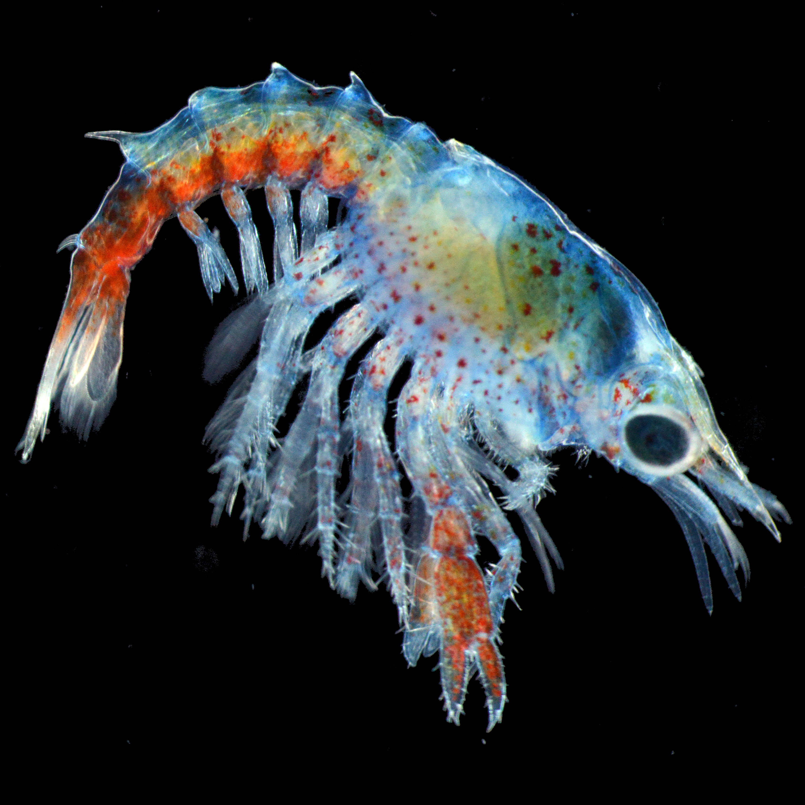
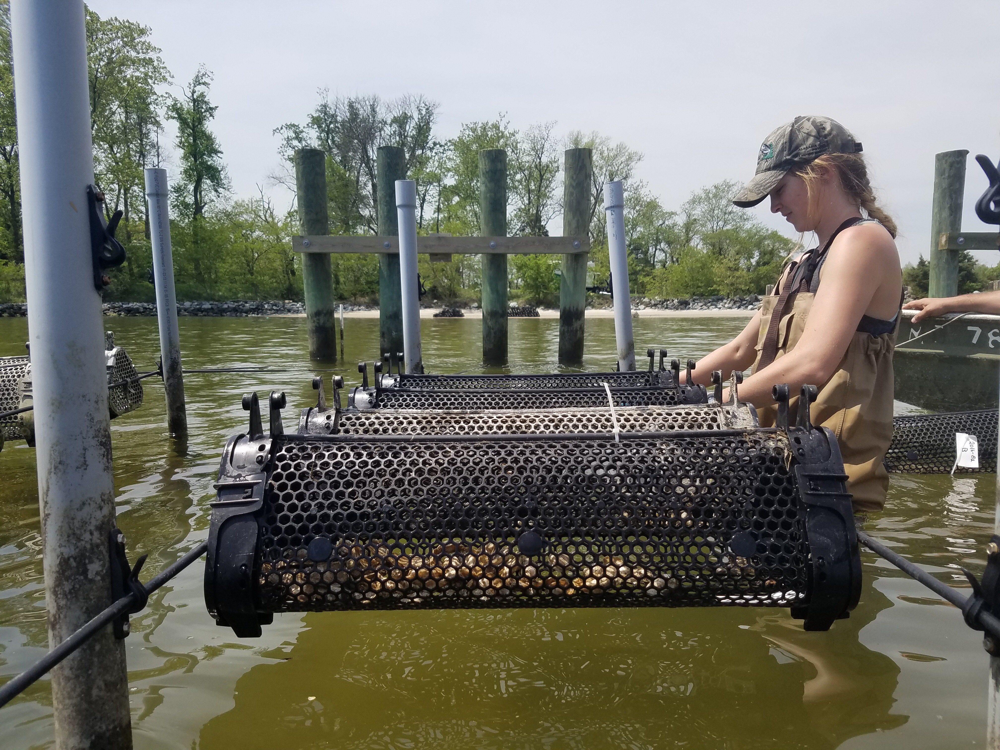
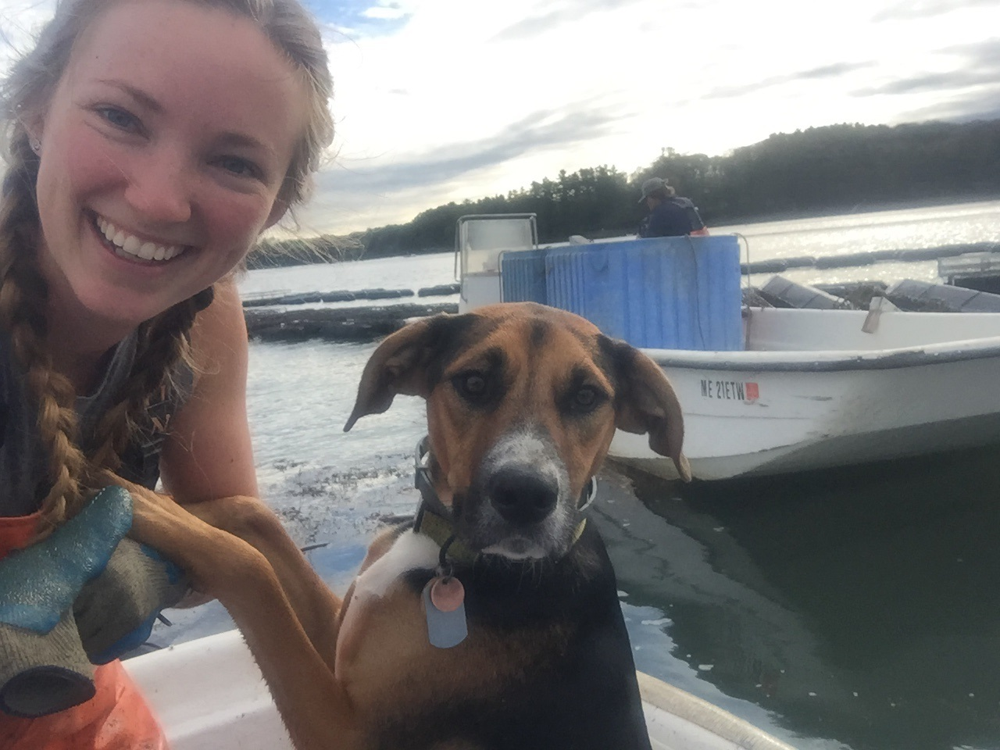
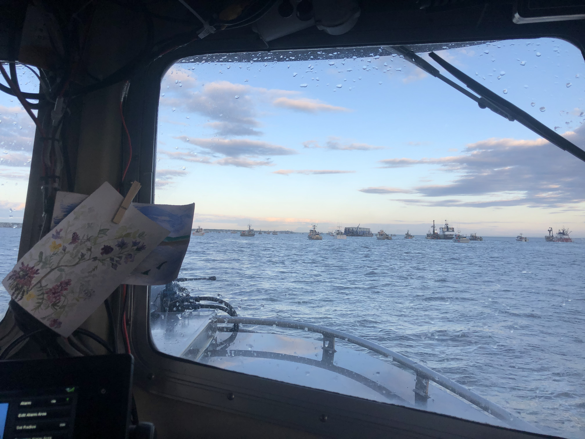
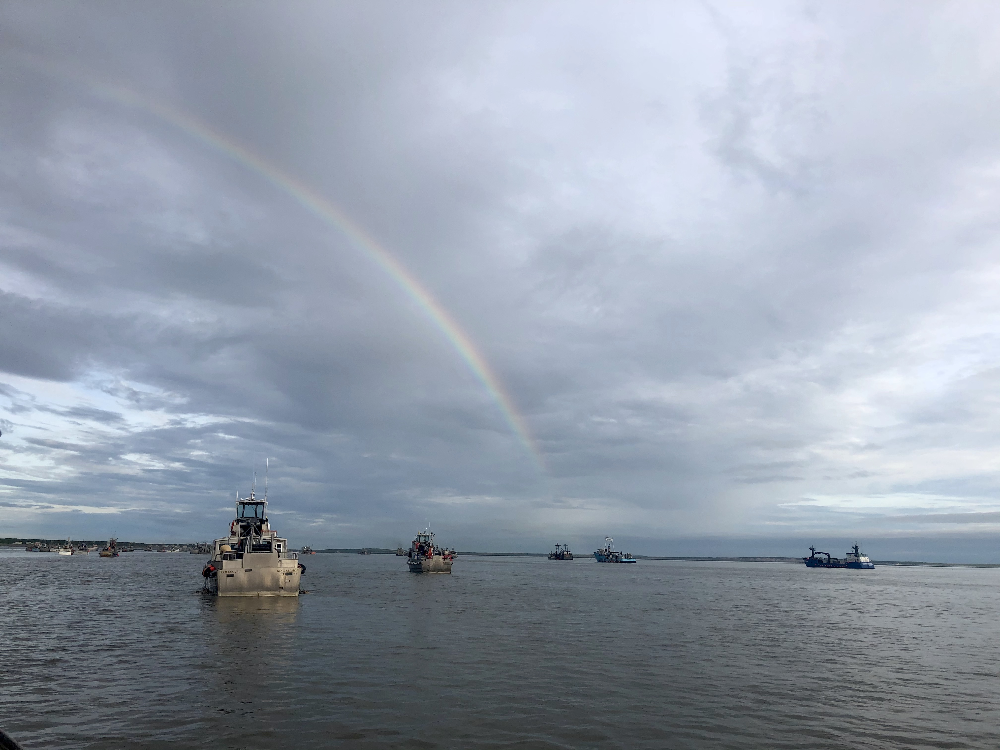

```{r setup, include=FALSE}
knitr::opts_chunk$set(echo = FALSE)
```


I graduated from Warren Wilson College in 2015 with a Bachelor of Science degree in Biology. I've has always gravitated towards the coast for both my career and many varied pastimes and am driven by the potential that healthy marine systems hold to sustain communities with food, energy, employment, and invaluable ecosystem services. During my undergraduate education, I carried out research in Maine for my thesis on the effect of climate change conditions on larval lobster development. 




After graduation I began work in the environmental nonprofit sector in North Carolina before transitioning into research and industry environments. I entered the aquaculture field at Virginia Institute for Marine Sciences where I focused on breeding and genetics research of oysters. 



I then returned to Maine to continue research and fieldwork with commercial shellfish hatcheries and farms. 

.JPG)



Before heading back to school to begin the MESM program at Bren I participated in the Sockeye salmon commercial season in Bristol Bay, AK.






My experiences focus on encouraging sustainable fishing practices and improving marine aquaculture methods to increase productivity and resilience of sustainable seafood production in a changing climate. I'm interested in developing collaborative solutions that are both restorative for the ecosystem and economically beneficial for coastal communities. I'm passionate about protecting marine environments and resources while developing innovative ventures and resilience-based management.


